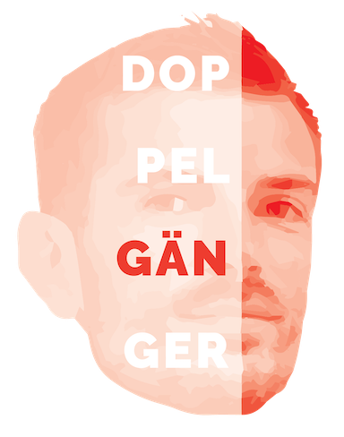

 
## DoppelGÄNger  

As I was working on my master thesis (for the AI master at KULeuven) -- a project that heavilies relies on PyTorch -- a thought struck me: I don't know jack about PyTorch. Well, it was more of a persistent feeling than an abrupt thought, but still. I decided to take on a small parallel project to get to know the library a bit more. I'm also using this as an opportunity to familiarize myself with PyTorch Lightning a little more.

The core idea: I want to create a fake profile pic for myself, using a Generative Adverseral Network. Here's my pipeline.

### 1. Gather data

Quite obviously, I'll need training data: in this case, that means I need real images of myself that will compete with fake images. The fake images will be generated by the *badum tiss* generator, and the discriminator will try to tell the difference. Hopefully, during training, both will get better at their jobs. 

I started off by cheating (sort of): I had Apple Photos give me all the images in which it recognized me, and copied those to a **raw** folder.

Next, I wrote a script to detect faces and cut them out: `data.py`. These faces are then stored as new images in a **faces** folder. There is a function to resize everything, but I'll let the DataLoader handle that (see further). One problem is that the script extracts all faces. Since building a classifier wasn't my goal here, I manually curated these images to obtain only 'my' faces. I put them in a **curated** folder -- they represent my training data.

### 2. Build GAN

Now, I need to build the training pipeline: I'm creating a DataSet class, a LightningDataModule, and the networks.

